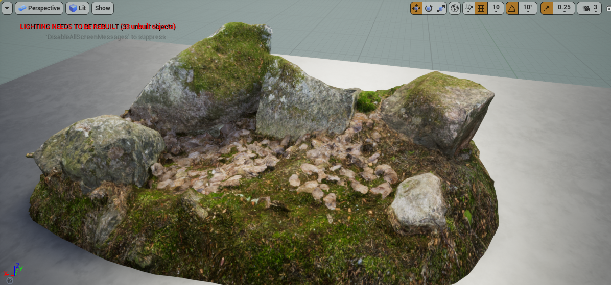
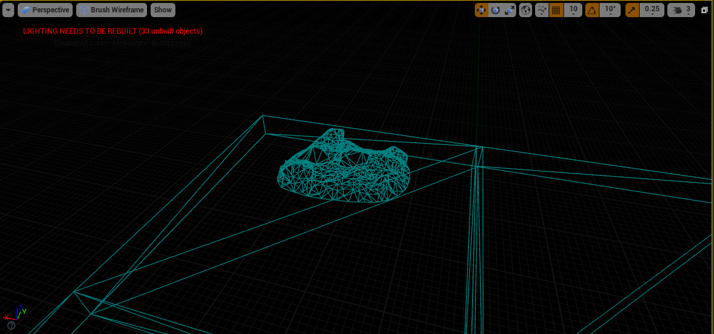

# Report - September 17th #

## Activities/Accomplishments and Concepts/Lessons Learned ##

### Concepts:
- Learning a model (specifically, training it to learn on its own)
- realistic map designs in Unreal
- moveable actors in Unreal Engine

### Activities:
I read the article assigned by Prof. Clark. Along the way, I took super detailed notes (it felt like I had to look up every other word). I got a reasonably good understanding of the terms
and concepts used in the article. 

Some of the more helpful sites I looked up during the course of the reading:
- [Explaining time horizons](https://forum.unity.com/threads/in-depth-explanation-for-time-horizon-hyperparameter.818169/)
- [Exploitation vs Exploration, plus the bandit problem](https://www.manifold.ai/exploration-vs-exploitation-in-reinforcement-learning)
- [Explaining back propagation through time](https://machinelearningmastery.com/gentle-introduction-backpropagation-time/#:~:text=Conceptually%2C%20BPTT%20works%20by%20unrolling,and%20the%20weights%20are%20updated.)

I would love to review the following concepts:
- how gradient descent is calculated (a brief overview is enough, just want to make sure I understood)
- how parallel workers submitting their evaluations of queries back into the model helps
- What "Adam" is, in regards to BPTT.

I also followed [this Youtube tutorial](https://www.youtube.com/watch?v=ATX7kmET4zE&list=PLUTAwZqzGLD9TLT9uBTD8V4_36EhhxFd-&ab_channel=Quixel) to create photorealistic assets. I think it went really well! I was able to create my own material using free assets from Quixel (which comes free with the download of Unreal Engine). 

As you can see, it's a pretty good recreation of a real surface.

I went one step further and actually learned how to create a different level of detail for certain distances, in order to help our computation time. The closer you get, the higher level of detail you see. In this case, that means there are more triangles in the image when you are closer.

Here's what that looks like from a distance: this is LOD (level of detail) 5, made of about 1,100 triangles.

When you get closer, it automatically switches to LOD 1, which is made of 11,298 triangles.

Note that I switched to wire models here because it's actually really hard to tell (at least for my eyes) when you switch to a lower level of detail. I figured though that we wanted to conserve as many resources as possible when building huge maps. Also note that there are only two levels: there were 5 LOD variants for the data set I downloaded, but I honestly couldn't tell the difference between them, so I went with a simple binary switch.

I also learned how to mix colors and adjust brightness to make it more real. I think this is a good starting point to being able to make realistic maps.

Finally, I watched [a tutorial on making moveable players](https://www.youtube.com/watch?v=w4nJ578XP48&ab_channel=BenOrmstad). I was able to download a character mesh for now, but it doesn't work great, so I'll be looking into making my own soon.

## Issues/Problems
- Just took me a while to get through the article - it was dense and I don't have a ton of machine learning knowledge to draw from (yet :) )
- the youtube video assumed lots of knowledge, which meant I had to be constantly looking up other things. It took me about 2 or 3 hours to get through half of it, but I learned a lot!
- The robot will not move once in the middle of the jump. Strangely, it will move forward and continue doing so if you first move forward then jump.

## Plans
- Now that I have the Udemy course, I'll try to finish that by next week, and hopefully be able to build an entire landscape that looks good enough for our robot to train with.
- I'll have to figure out how to make a character mesh. I think the video I watched mentioned Blender.
