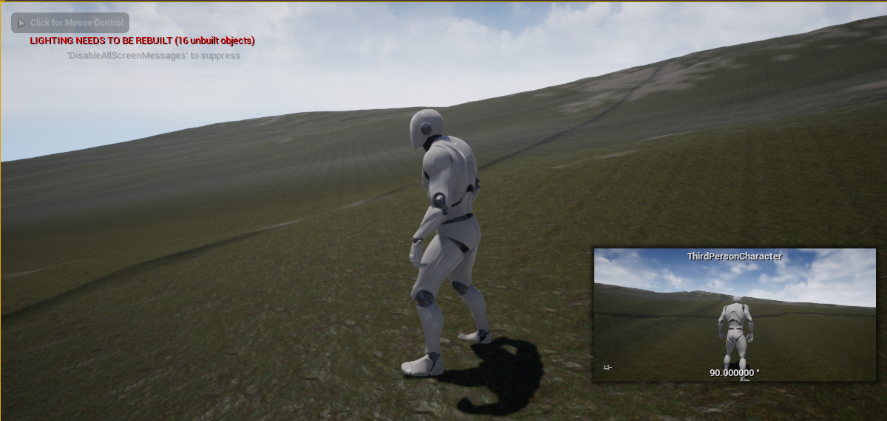
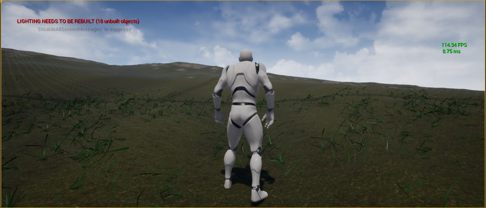

# Report - September 24th #

## Activities/Accomplishments and Concepts/Lessons Learned ##
- Learned how to automatically generate terrain (and quickly!)
- Learned how to make more realistic terrain with UE's materials tool
- Learned how to create lots of foliage
- created new level with auto generated terrain and foliage

### Concepts:
- terrain generation using World Machine
- Mass download of megascans assets using Bridge

### Activities:
- I spent a lot of time following the Udemy course. It was really helpful but super dense (and a little dated - many options were in different places etc)
- I used that knowledge to create my own level, based on terrain I generated using World Machine
- I also learned how to mass create foliage

Here's the terrain I generated:

Now with a little foliage to spruce it up

And here's the program that this came from!

## Issues/Problems
- I was only able to get the World Machine Basic version, which supports much smaller resolutions than Unreal. Luckily, the video had a neat workaround to that
- I'm having serious memory issues on my computer - I installed it on the C drive initially and when I tried to move it, some wonky stuff started happening. I lost a bit of work here but mostly it just slowed me down with constant errors. 
- The terrain doesn't look great, partly due to my own subpar design skills. I'll read up more about how to use the materials page better. So far the tutorials I've followed have showed me what to do, but not how.

## Plans
- Work on making a better character model next time
- Finish the last of the course
- If finished soon, maybe start on the ML elements!

I think in one more weak I can have this figured out. My only issue is that I dont' know how to automatically generate this sort of stuff. Using megascans and worldbuilder is a very hands-on project and I'm not sure how we're going to get all the data we need without it.

