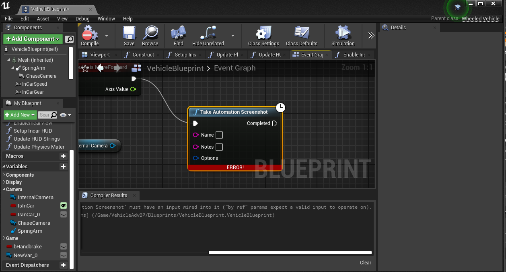
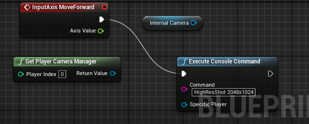
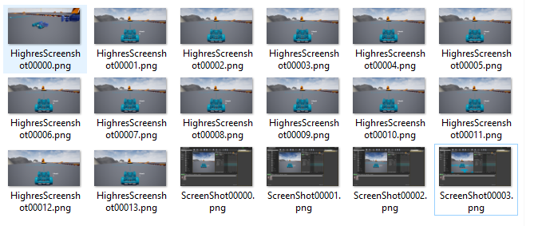

# Report - September 24th #

## Activities/Accomplishments and Concepts/Lessons Learned ##
-  Working with Cameras in Unreal
- Switching cameras
- Working with Sequencer

### Concepts:
- Sequencer in Unreal
- Complex vehicle models

### Activities:
- I spent a lot of time reviewing the model for the rover I downloaded, just trying to understand how it worked so I could potentially use it or create my own later
- Spent some time researching how to import custom meshes - Alex created a nice one that she shared with me, but we're still working on getting it converted to the right type.
- I spent a lot more time figuring out how to take screenshots based on specific input. 

I read through the sequencer tutorials and followed them, but they didn't seem to be that helpful. I think they're more geared towards creating cinematics for video games, such as like cut-scenes or replays. 

I actually only found out about how to take screenshots through googling more sequencer tutorials. Initially, I was trying to use the take automation screenshot blocks. But those didn't work, for some reason. I kept getting errors like this:

Worse, I couldn't set the camera that it was taking the pictures from. 

However, I stumbled across a forum that had a workaround: you could use the execute command block to just manually call for a screenshot.

And it worked! I still haven't been able to choose the camera, but for any given input, I can now make it take a screenshot.

I'm still having issues where it takes way too many screenshots, because it seems to be accepting a lot of input even when I don't press buttons. But I think I can solve that pretty easily by setting the input to be a specific button press and not an axis input.

## Issues/Problems
- We haven't been able to convert the cad model Alex made into a FBX file. 
- I had a lot of trouble getting a screenshot to originate from the camera. I looked at some tutorials, including the following:
    - https://github.com/Microsoft/AirSim/issues/1281
    -  https://chiaroscorner.wordpress.com/2018/02/20/how-to-take-a-high-res-screenshot-in-play-mode-ue4/comment-page-1/
- screenshots are happening too fast - even without proper input. I'll have to do more research into the specific blocks to see why that is

## Plans
- fix the screenshot issue (should be easy enough)
- figure out how to switch cameras
- figure out how to get the screenshots and inputs associated with them to a csv or similar file for use in training
- start trying to build a model simulator. I think we're training on Edmunds ballroom, right? In which case I'll try to start building Edmunds.

