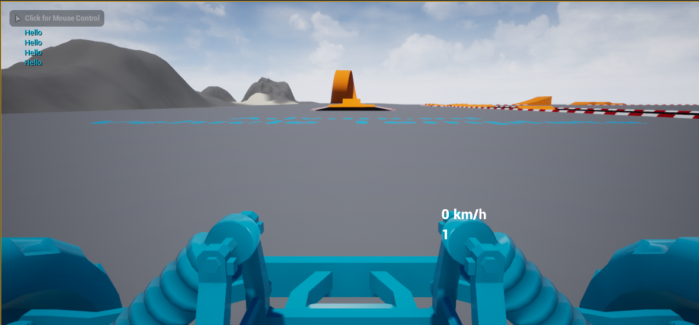
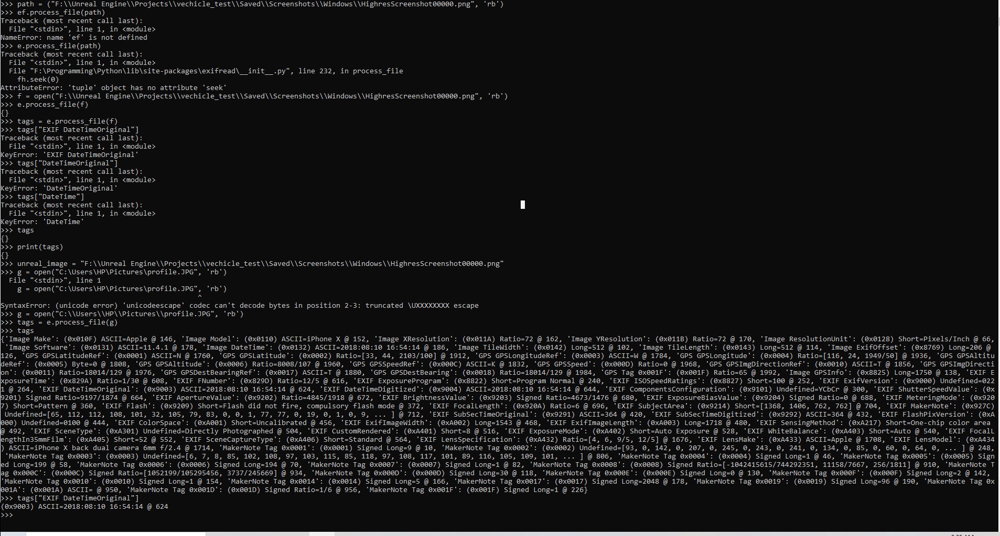

# Report - October 15th #

## Activities/Accomplishments and Concepts/Lessons Learned ##
- Fixed screenshot issue
- Learning C++ now to write to files
- Explored how libraries work in Unreal

### Concepts:
- C++
- Running scripts from Unreal
- Changing cameras
- Creating functions and scripts

### Activities:
- I first went in and fixed the issue with thousands of screenshots being taken, by fixing the inputs to allow the correct buttons to take screenshots
(since I don't have tons of space, I made them different buttons than the steering buttons for now)
- Then I went and fixed it so that the correct camera was taking screenshots. I had to play around a lot with how the camera worked, and found that you can
technically only change this with C++, which I don't fully know. Otherwise it just takes the first camera instance it sees. I tried simply switching the camera
in the blueprint, but it wouldn't let me, so I had to go into the viewport and just adjust the camera.

Now it's just like the one we're designing!

- Then I watched a couple of youtube tutorials about how to create a script, until one finally worked. I was able to create an actor class that took in a 
function that I created. I'm still not sure how to run a C++ script from the blueprint, but I got it to log whenver I clicked a certain input, so I"m sure
it'll be possible to match screenshots to inputs. 

## Issues/Problems
- I spent a lot of time thinking about how to match the pictures taken by the game to the input they received, and had a couple of ideas.
The one I thought was promising was to write a python script that would sort the pictures based on their metadata. I spent a lot of time 
researching python libraries to see what functionality they offered, and tried two: PIL and exifread. The reason I tried two was that PIL
didn't seem to be working. After writing several scripts, and searching through stackoverflow for my errors, I finally realized the issue:
Unreal Engine screenshots aren't generated with any metadata. I still don't know why this is, but it was extremely frustrating. I think what 
I'll do now is just manually delete the folder every time I start the game, and write a text file that just inputs the command every time. When
that file is sorted, I should be able to write a script that merges that with the photos in some sort of csv.

## Plans
- Mainly, figure out how to run C++ from Unreal. I don't want to code the whole thing though, so I want to make sure I can do this from a blueprint.
- Then, start to tie in everything together.
    - I'll have to make a model of the training environment (did we say it was going to be Edmunds hall?)
    - I might have to make a new vehcile based on Alex's designs? I personally think the given rover is good, but up to you!
    - Then set it to start taking pictures and start producing the dataset! I might also write a script here to flip images/inputs so we get double the data :)

