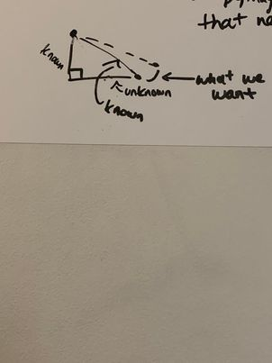

# Report - Week of Feb 6th, 2022 #
*this will be a long one, since I'm doing two weeks at a time. Had to catch up with a class I'd permed last semester this past week*

## Agenda ##
1. Debug ground movement
2. Move forward with pre-training

The only thing left to do on the gaitpt stuff is to fix the fact that the legs sometimes dip below the ground when walking. Specifically, the front two legs seem to dip below the ground when they're performing the backwards step. 

## Activities/Accomplishments and Concepts/Lessons Learned ##
From observation / debugging last week, I confirmed that the goal assignment didn't seem to be the issue - no goals were assigned that were below the ground. Therefore, I started this week by trying to figure out how I could modify move_tip() to correctly stop before dipping below the ground. My conclusion was that the ankle was swinging too wide, so that even if points 1 and 2 were both above the ground, the pendulum movement caused it to go below.

The solution I envisioned was to add temporary limits to the foot that would prevent it from crossing the ground boundary by figuring out what the max angle it could go before dipping was. I realized I didn't actually need to add new limits, since that might get confusing. I could simply modify move_tip to provide a different angle for the rotation_amount if the current rotation_amount would take us below the ground. 

I first thought of a brute force solution, which was just trying all the angles until we got one below the ground, then use the one before that. That solution would've taken too long, so instead I came up with one that used Pythagoras theorem; basically trying to figure out what the optimal base leg of the right triangle created by the ankle and the ground was. Here's what that looked like in brainstorming:

I implemented that and verified that it was clipping most of the values in the leg. Unfortunately, that didn't seem to be affecting the way it moved at all!

## Issues/Problems

## Plans for next session
