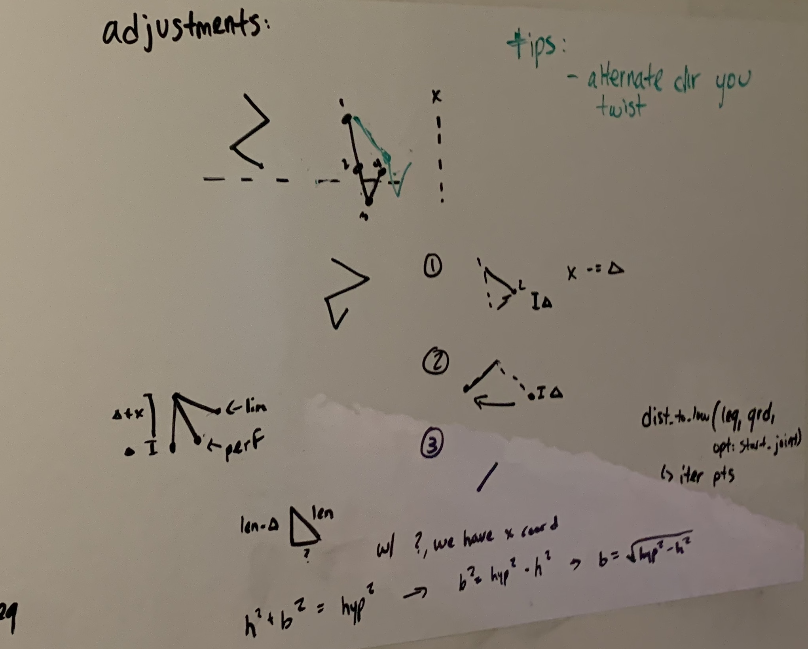

# Report - Week of Feb 6th, 2022 #
*this is part two for the week; first was 1-31*

## Agenda ##
1. Fix the issue with legs dipping below ground
    + evaluate previous solution
    + find root cause

## Activities/Accomplishments and Concepts/Lessons Learned ##

### Accomplished
- Root cause found: inadequate y delta allowance and no suitable correction mechanic
- Solutions implemented: proportional y delta allowance and height correction mechanic added

### Height Correction
I started out with the solution I developed in the last report. That one wasn't working ideally, and I wasn't sure why.

One of the issues I discovered was that it wasn't the fault of only one joint: my solution only aimed to fix the ankle to foot segment, but height issues add up from all segments. Therefore, I knew my new solution needed to start from the top, where it would have the most impact. 

As I was experimenting with a solution, I printed out the rotation amounts so I could see what scales I was working with. I came to the conclusion that subtracting -0.1 from the first joint (to make it bend forward slightly more) got me really close to where I wanted to be. That's because, by bending forward, that joint was shortening the leg and therefore preventing it from needing to dip below ground.

I expanded that solution by applying that rotation delta to all joints, alternating positive and negative as I went down so that the leg would bend like an accordion. That worked pretty well, but there was a bit of jumpiness each time it made a correction. Additionally, the fact that it needed to dip below the ground first in order to start the correction wasn't acceptable. By switching the if statement to `<= self.ground`, I made it more likely to prevent dipping below the ground in the first place, at the expense of some jumpiness at the beginning of the walk cycle, since the leg starts near the ground. 

I found that the above trade-off wasn't too bad: because of the way we determine the ground, most of the legs are already a tiny bit above the ground; not enough to be noticed. I figure that the last joint will have a foot attached to it anyway, so it should be ok to not be touching the ground. 

I tried to implement a smarter solution the correction that would hopefully make it less jumpy. It relied on finding exactly the right angle that each joint needed to rotate to in order to decrease the distance from the first joint to the lowest point the perfect amount. Here's what the plan looked like in sketch:

The basic format of the function would be a for loop that would start with a delta that represents the total distance below the ground that the leg is. Starting from the top, we move each joint either the max amount or the perfect amount to reduce delta to 0. If we weren't able to reduce delta to 0, we move down a joint, attempting to fold that one to get the height reduction we need, and so on.

I haven't been able to get that function to work. For now, I've moved back to a simpler model that adds -0.1 to odd indexed joints' and 0.1 to even indexed joints' angles. 

### Hind Legs
One of the other pressing issues was that the beg legs weren't moving in a realistic way - they would stretch out in a way that caused the ankle to be lower than the foot as it walked. Most of the time, that also meant the ankle moved below the ground while the foot remained above. That's how I became aware of the issue. 

The 'accordion' correction didn't work super well for correcting this particular mistake. That's probably because the accordion method relied on higher-indexed joints being lower on the plane than lower-indexed joints. That's a pretty normal assumption, so I had to find something else.

When comparing to Prof. Clark's working example, I saw that the hind legs didn't have that issue. In my walk gif too, they seemed fine. Those observations led me to the solution: the configuration worked fine for walk but not for other gaits, which expanded on the original functionality. So my task was to look for hardcoded values that shouldn't apply to other gait patterns.

I found that the vertical_distance value of 0.4 wasn't great. When I manually adjusted it to 0.6, trot got a lot better and walk got a bit worse. From there on, I knew that it needed to be related to the type of gait the animal was using. But how? My first thought was to tie the y delta directly tot he type of gait, but our current architecture made passing that information unwieldy. 

Luckily, some more investigation pointed me in the right spot: I had already had to change x_delta to make each gait work, and we already had different values for that variable based on the gait. I simply made y_delta proportionate to x_delta, and it worked out a LOT better. 

## Issues/Problems
- Accordion calibration function isn't working with more exact values. This would be nice to implement so that we end up with less jumpiness
    + "jumpiness" is best described as an overcorrection of the height adjustment, which causes the leg to be moved too far upward, necessitating further downward movement to achieve the next goal. This overcorrection causes excess up and down movement. 
    + The ideal would be to move upwards just far enough that the leg perfectly touches the ground, allowing it to smoothly glide along the surface of the ground. 

## Plans for next session
- Make another attempt at the 'perfect' calibration function 
- Have a chat with Prof. Clark to see whether we're ready to move on, or what further changes should be made