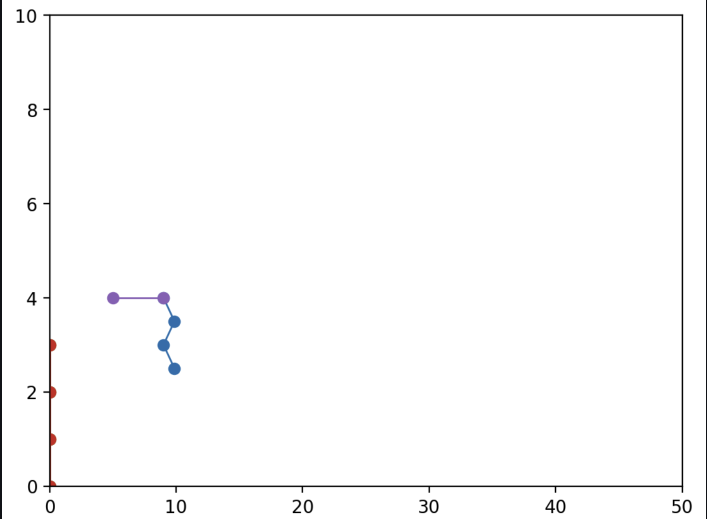
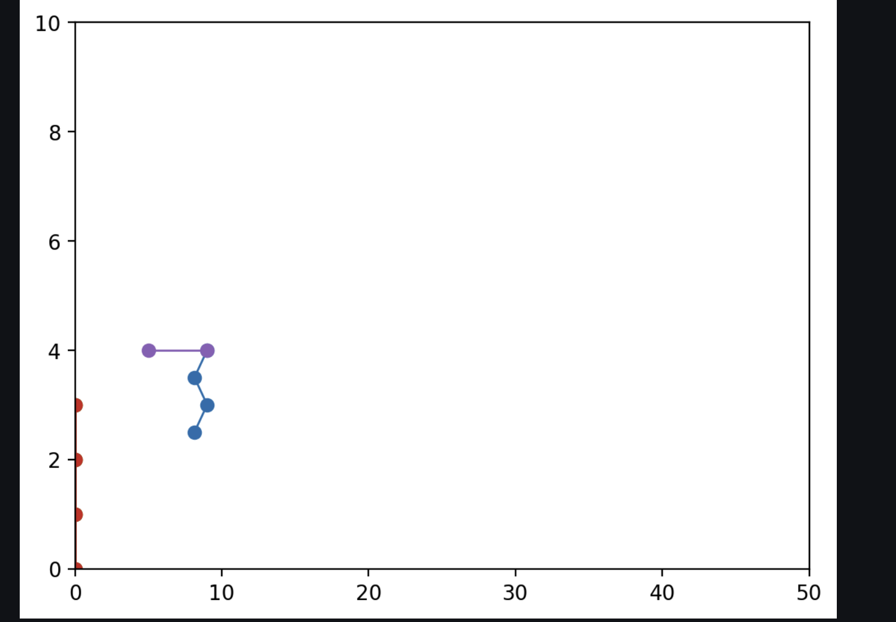

# Report - Jan 5, 2022#

## Agenda ##
- Modify Gait to be per foot rather than per turn
- Remove translation from main functionality
- Move Animat to center of screen when plotted
- Modify HingedSegment functionality to incorporate a max angle
- Modify get_poses to support a treadmill system with the new Gait objects
- Move to one leg for testing

## Activities/Accomplishments and Concepts/Lessons Learned ##
Modifying Gait presented no issues. Each column now represents one leg's full sequence.

Removing the translate functionality was also surprisingly easy. Because calculate_poses already worked with relative positions, we actually didn't need the hip movement to make it look ok. 

Modifying it to use only one leg was also quick, just required changing the hardcoded segments constructor. That's still a prominent to-do item.

However, I ran into issues once I started working more closely with the angles. The very first thing I tried to do was set each segment of the leg to be at angles similar to the dog. That was super difficult because it felt like none of the changes made sense. 

One of the issues is I think we were calculating the endpoint incorrectly. According to [this StackOverflow post](https://stackoverflow.com/questions/8698564/using-python-to-create-a-unit-circle-calculator), (x,y) is calculated as (sin, cos), whereas we had (cos, sin). I changed that but it still didn't look quite right. I ended up fiddling with that, the start angles in HingedSegment, and the set_angle function in HS. The real issue was that I was using degrees and not radians! The angle_between method of point uses atan2, which returns a radian amount. The mismatch between degrees and radians was causing lots of issues. 

Once I figured that out and converted my measurements, I think things are going better. I decided to keep the change to HingedSegment that replaces the angle instead of adding to it. I think that will allow us to regulate the angle restrictions much better. 

Before, I was just passing in one max_angle. That's not really feasible, since moving forward is a negative angle and backwards is positive. A simple max() call only works for one side of it. I think I'll move to using a max_range and ensuring that the angle is within that range. 

Quick update: I moved to passing in a range of angles and modified leg to once again move all segments. I believe we're hitting the appropriate angles now! Here's what that looks like:

                                                                                                                                                                                                              ### Step 1

### Step 2

## Plans for next session
Once I get the angle restrictions to work, I can work on getting the poses to work. From there, I can work on the leg creation functions and figure out whether I want to read those from a file or something.